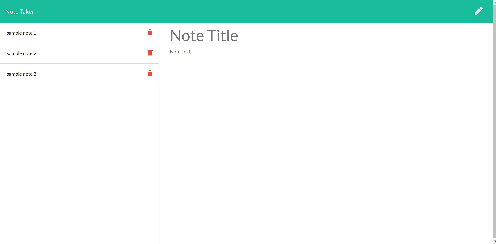

# Unit 11 Express Homework: Note Taker

## Description

<a href="https://notetakerml.herokuapp.com/">Click here for deployed application</a>

This is an application that allows users to save, retreive, and delete short notes.

This is a nodeJs application that uses servers and routes to store and get information. This application uses Express and fs. 

MIT License
Marc Langlois 2020